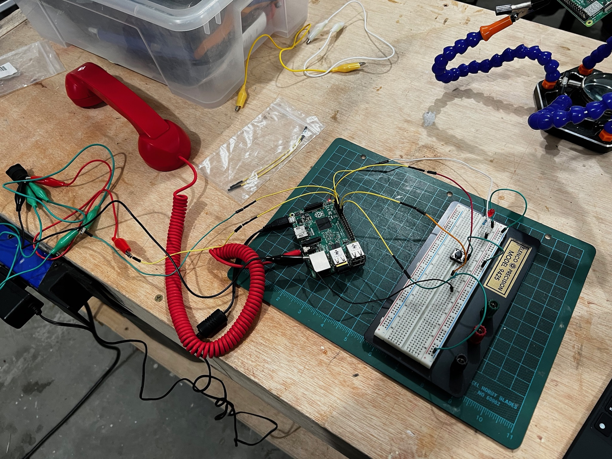
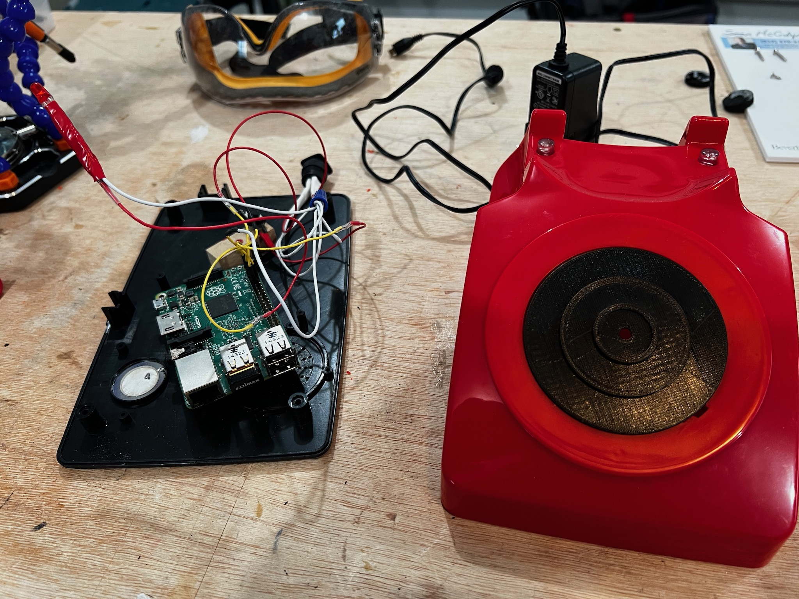
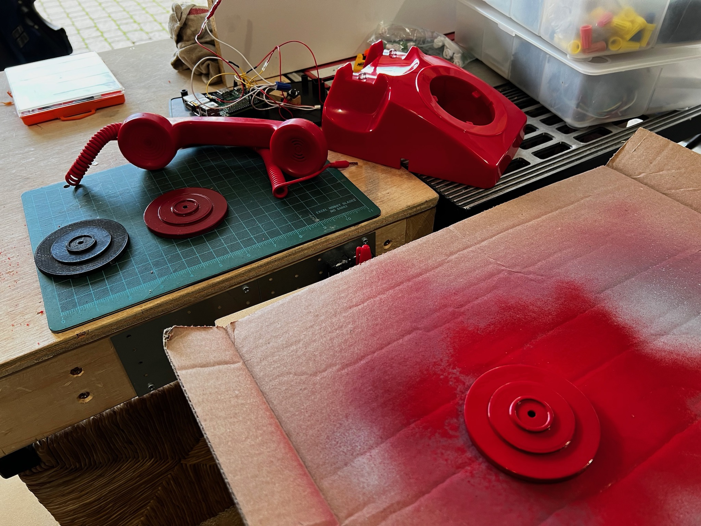
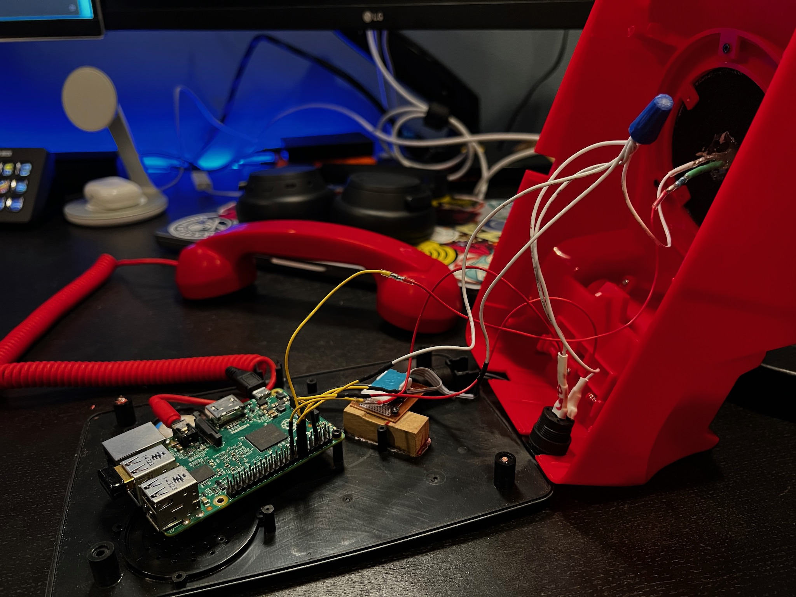
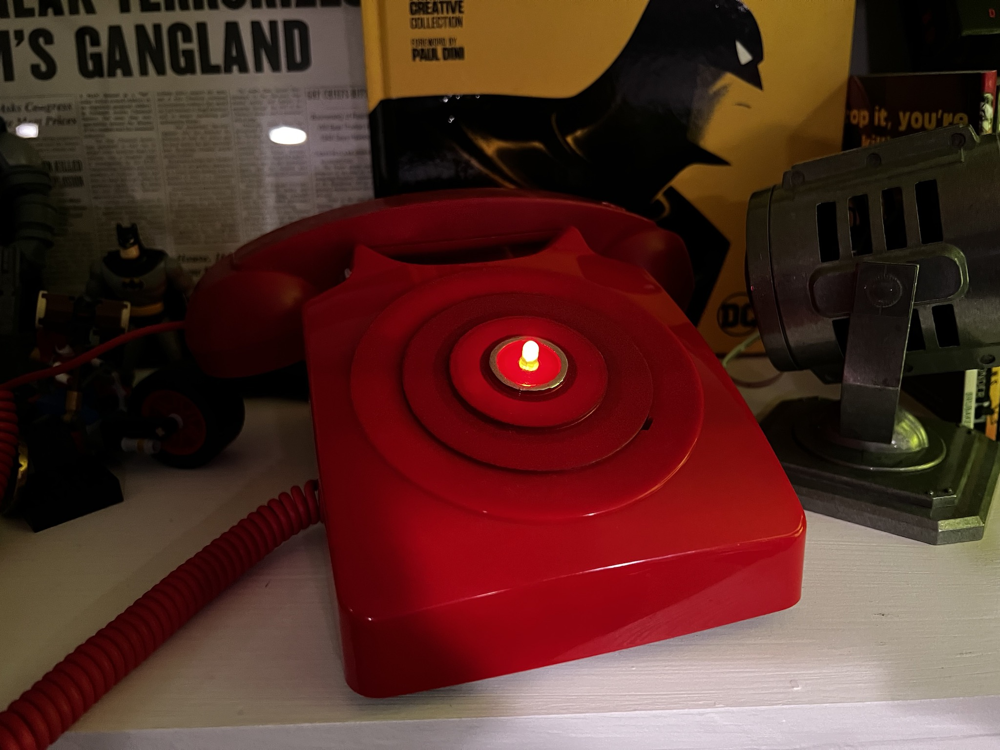
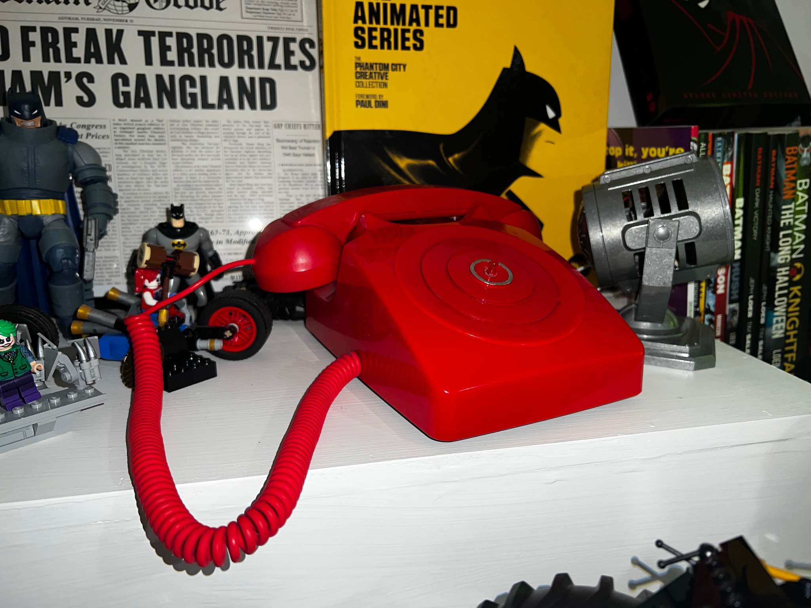
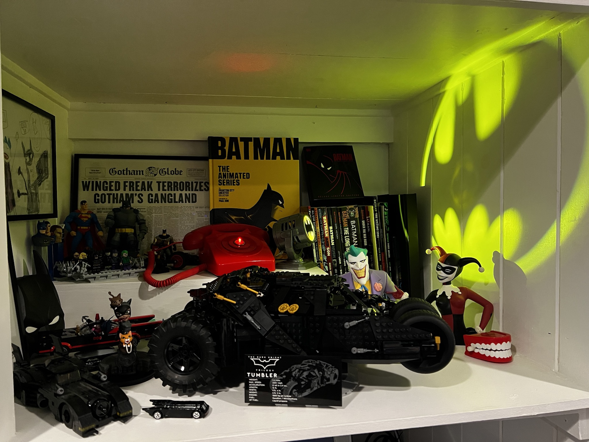

# The Bat Phone

A "working" replica of the 1960s Bat Phone.

## Demo

(Click the picture above for a short YouTube video demo.)

I have a small Batman collection and thought it would be cool to have a replica of the Bat Phone from the Adam West series. This version "rings" semi-randomly throughout the day by flashing it's red light. If you pick it up while it's ringing you can hear a clip from the show, otherwise you get a dial tone.

## Parts

**Phone Base:** 

[I found this model on Amazon](https://www.amazon.com/dp/B098RYL855/ref=cm_sw_em_r_mt_dp_VS4C6HZS7EKWGHEA6X09?_encoding=UTF8&psc=1) which was cheap, seemed easy to remove the parts I didn't want, and was a great classic shape. I removed the dial and all electronics but the reciever switch.

**Dial Insert / LED Housing:** 

Designed and 3D printed myself. [Here is the STL file](models/bat_phone_insert_v3.stl).

**On/Off Switch & Light:** 

A momentary button with LED I had in my workshop ([available at Adafruit](https://www.adafruit.com/product/1439)). The one I have in place is not ideal, but it works. 

**Red Light:** 

Standard LED light you can get anywhere.

**Reciever Switch:** 

Repurosed from the phone circuitry. I orignally had a cheap button under the reciever lever, but it was pushing back on the reciever too much, even after trying to add weight to the reciever. I removed the switch in favor of the switch from the phone and it works great, but the code is a little wonky because of how the switch worked.

**Reciever:** 

I happened to have a novelty phone reciever that terminated in a minijack that I recievved as a corporate gift years ago and I used that. [You can find something simliar on Amazon.](https://www.amazon.com/CellCase-Telephone-Microphone-Cellphone-Smartphone/dp/B08Y8J5LK5/ref=sr_1_2?crid=2ATWJRB1FSH6M&keywords=red+phone+receiver&qid=1641364342&sprefix=red+phone+receiver+%2Caps%2C120&sr=8-2)

**Brains:** 

Overkill, but I had a spare Raspberry Pi 3 B in my workshop and since that has a minijack audio output already, it was what I used. A better option would be a small Ardiuno (though with enough memory for the audio clips) and an audio out interface. If you do use a Raspberry Pi, I have included a [setup.sh](setup.sh) file that includes the commands needed to run to get the code I have working.

**Paint:**

[Rust-Oleum Enamel Cherry Red](https://www.amazon.com/Rust-Oleum-248568-Stops-12-Ounce-Cherry/dp/B003ES43D0/ref=sr_1_7?crid=3P1X26AA6SOO8&keywords=rustoleum+spray+paint+enamel+cherry+red&qid=1641365617&sprefix=rustoleum+spray+paint+enamel+cherry+red%2Caps%2C122&sr=8-7) proved to be a great color match with the phone body, and I used [a chrome paint pen](https://www.amazon.com/gp/product/B09C1SRRBW/ref=ppx_yo_dt_b_asin_title_o03_s00?ie=UTF8&psc=1) to add the detail around the LED.

## Code

In it's current state the code is quickly written Python, but it works and I might go back and refine it. There are two parts: [batphone.py](batphone.py) and [shutdown.py](shutdown.py)

_batphone.py_ is the full service that handles the "phone" functionality. _shutdown.py_ is just a small script that watches a specific GPIO script for a signal to properly shutdown the Pi.

## Sound

You can use any files for sound, but I do have my collection of wav files that I used for source in [wavs/source](wavs/source/) and what I came up with in [wavs/answers](wavs/answers). I spent very little time on this aspect so if you have better ideas or any skill at audio editing at all, I would _love_ to hear what you came up with.

## Build Photos

Initial breadboarding.

Mounting in the case and testing a 3D printed insert.

Paiting v3 of the LED insert (once I found the _right_ "Cherry Red" color).

The last minute switch to the phone reciever switch!

Final display photos.
